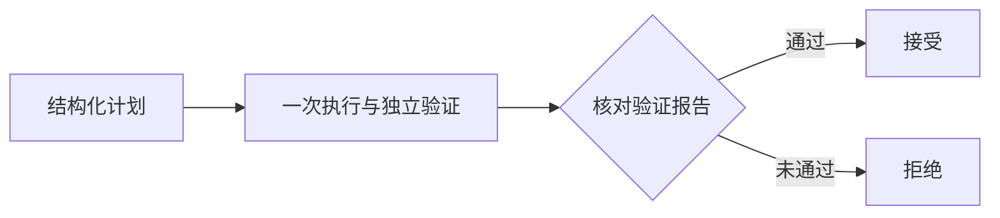

# LangGraph 有限修复工作流

## 本轮交付

新增独立 `workflows/repair.py`，通过 LangGraph StateGraph 和 Pydantic 状态/计划组织一次修复任务。旧执行器、评分、Prompt、工具集合和预算保持原样；服务默认继续使用既有方式，显式指定 `workflow=langgraph-v1` 才启用适配层。



计划由代码生成，包含 task_id、允许修改的文件、执行模式、Token 预算、一次尝试上限及两个固定动作。`run_task` 在内部完成候选执行和独立副本验收，因此图中使用 `execute_and_verify` 节点；结果分支再核对 status、accepted、verification.passed，拒绝伪成功，不增加模型调用或失败重试。

实现参考 [LangGraph 官方 Graph API](https://docs.langchain.com/oss/python/langgraph/graph-api) 的 StateGraph、Pydantic 状态和条件边。本机 LangGraph **1.2.14**，可选 extra 约束 `langgraph>=1.2.14,<2`。无图循环，recursion_limit=5；一次执行仍可能包含原 Agent 内部的有限工具循环，这与“图仅执行一次”分别计量。

## 接口和产物

安装并重启自己需要升级的服务后，在项目根目录运行；本轮没有重启已有用户服务：

```powershell
python -m pip install -e ".[service,workflow]"
python -m uvicorn service.app:create_app --factory --host 127.0.0.1 --port 8001
```

另一个终端提交：

```powershell
$graphBody = '{"task_id":"timeout-units","mode":"scripted","workflow":"langgraph-v1"}'
$graphHeaders = @{ 'Idempotency-Key' = 'graph-demo-001' }
$graphTask = Invoke-RestMethod http://127.0.0.1:8001/tasks -Method Post -Headers $graphHeaders -ContentType application/json -Body $graphBody
Invoke-RestMethod "http://127.0.0.1:8001/tasks/$($graphTask.id)"
Invoke-RestMethod "http://127.0.0.1:8001/tasks/$($graphTask.id)/artifacts/workflow.json"
```

`workflow.json` 原子替换，保存 planned、executing、reviewing、succeeded/failed 阶段及事件、计划、结果摘要。既有 result.json、runs 下报告/补丁/Agent Trace 和生命周期 SSE 保留。该文件不是 Token 流，也不是 LangGraph 原生 checkpoint。

缺少 workflow extra 时，显式图请求返回 503，默认请求正常可用。省略 workflow 与显式 null 均从规范化请求中去掉该字段，保持升级前幂等指纹兼容；同键更改为图模式返回 409，不混用旧任务。图模式请求自身也通过既有 SQLite 保存和重放，重启后不会执行已完成任务。

## 取消与错误语义

取消继续使用 `/tasks/{id}/cancel`，由服务管理器结束图 Worker 及执行后代，并持久化 cancelled。执行中被取消时，workflow.json 保留最后的 executing/pending 快照；以任务查询的 cancelled/interrupted 为最终运行状态。读取该文件无需等任务结束。

服务重启沿用既有恢复规则：queued 恢复执行，running/cancelling 清理后 interrupted，不自动重放有副作用的节点。没有配置原生 checkpointer、interrupt/Command 审批或节点级续跑；不能把本轮写成 LangGraph 原生持久化恢复能力。

适配器异常保存 error_type，不保存可能包含凭据的异常消息，随后任务失败；图失败不自动再调用模型。输出目录不能进入 fixture，也不能复用已有 workflow.json，避免覆盖现场或重复执行。

## 验证

```powershell
python -m pytest tests/test_workflow.py tests/test_service.py tests/test_service_persistence.py -q
python -m pytest tests -q
python -m deploy.acceptance
```

初轮 30 项专项通过；新增用例涵盖真实 scripted / unchanged 独立验证、伪成功拒绝、无自动重试、异常信息去敏、尝试上限、旧请求指纹、图请求重启重放、快照下载及真实 Worker/子进程取消。随后补充复用快照及 fixture 输出拒绝的回归。

Docker 镜像已包含 workflow extra 和适配层；容器验收新增图请求真实修复、快照及幂等检查，并纳入所有工作流回归。最终本地全量 **852 passed、2 skipped（112.96 秒）**；Linux 专项 **59 passed、无跳过（42.65 秒）**，16 项容器端到端检查全部通过。Ruff、pip check 和 Git diff 空白检查通过。没有调用真实模型，不产生新的检索或修复收益结论。

版本控制摘要：[langgraph-workflow-acceptance-v1.json](langgraph-workflow-acceptance-v1.json)；完整本地记录 `.tmp/deploy-acceptance/0c93443cc7/acceptance.json`，包含依赖、镜像 ID、测试与 Docker 命令。验收容器/网络已移除，任务卷 `corecoder-acceptance-f66997351b_task-data` 保留。直接执行适配器的 pilot 在 `.tmp/workflow-v1-pilot/`，独立验证通过。

## 简历与下一步

可表述为：使用 LangGraph/Pydantic 实现有限修复编排、结构化执行契约、独立验证结果分支、诊断快照和服务级取消，通过适配层复用既有执行器。

LLM 动态规划/任务拆解、反馈修复、人工审批、原生节点 checkpoint 与恢复仍是后续范围。该首版是明确有界的编排入口，服务仍使用 SQLite 单进程队列；PostgreSQL/Redis、多用户权限和每任务容器沙箱也未实现。
