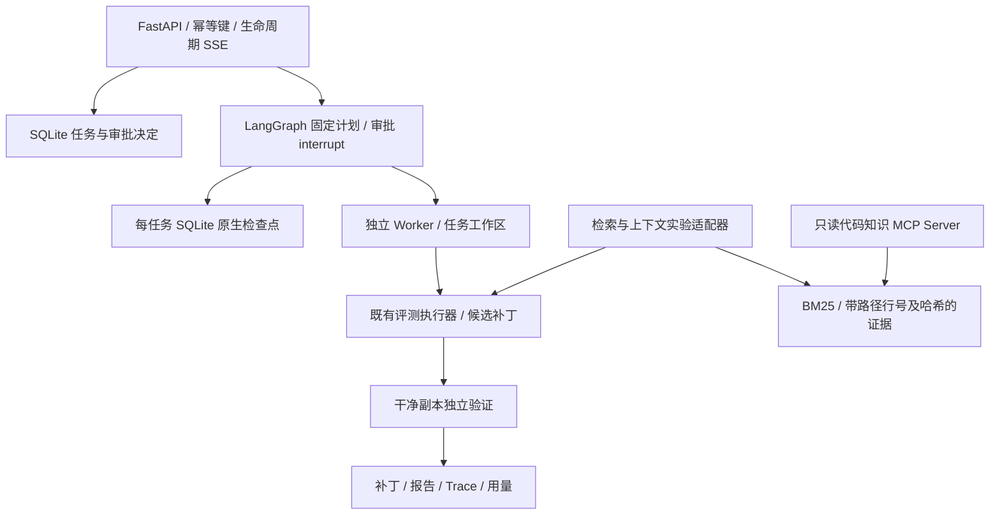

# CoreCoder 扩展项目总览

更新：2026-10-07。定位：基于 CoreCoder 的代码修复实验与本地服务，作为 AI Agent / LLM Application Engineer 求职项目。

## 核心需求与完成状态

输入可信任务的缺陷描述和指定源码版本，生成候选补丁，由独立验证器判断结果，同时记录证据来源、Token、耗时与失败原因。围绕同一执行器比较检索和上下文策略，再通过 API、MCP 和持久化审批提供可演示的工程入口。

核心研究问题：在固定 LLM、工具集合、任务预算和评测协议下，不同代码检索与上下文组织策略如何影响修复结果和执行成本？工程问题：任务如何提交、审批、取消、恢复，并防止重复执行？

**当前阶段可以交付。**评测、实验报告、本地服务、MCP、审批检查点和容器验收均有记录。服务仅接收 catalog 中的可信人工任务；真实仓库实验通过独立脚本运行，尚未将任意 GitHub 仓库接入服务。完整跨文件基准和全部 JD 要求未完成。

开发必要性来自对内部机制的实现、替换和验证需求：能够固定输入与预算，改一种证据策略，再用相同独立评分解释差异。这是求职工程作品与探索性实验，没有真实用户需求验证或优于成熟 Coding Agent 的证据。

## 阅读入口

| 要看什么 | 入口 |
| --- | --- |
| 5 分钟离线工程演示 | [demo-guide.md](demo-guide.md) |
| 简历与面试说明 | [resume-and-interview.md](resume-and-interview.md) |
| 求职贡献、代码与验收的对应证据 | [portfolio-evidence.md](portfolio-evidence.md) |
| 实现/证据/未完成清单 | [delivery-checklist.md](delivery-checklist.md) |
| 最新工程验收摘要 | [workflow-approval-acceptance-v1.json](workflow-approval-acceptance-v1.json) |
| 真实仓库实验阶段结论 | [second-repo-repair-v1.md](second-repo-repair-v1.md) |
| 最新补丁定位优化与失败归因 | [anchored-patch-v1.md](anchored-patch-v1.md) |
| 符号定向检索与三轮修复对照 | [symbol-directed-retrieval-v1.md](symbol-directed-retrieval-v1.md) |
| 公开检查与一次反馈修复 | [repair-public-feedback-v1.md](repair-public-feedback-v1.md) |
| 参数转发上下文与反馈对照 | [repair-forwarding-feedback-v1.md](repair-forwarding-feedback-v1.md) |
| 盐值关系矩阵与离线变异验证 | [salt-relations-audit-v1.md](salt-relations-audit-v1.md) |
| 关系矩阵真实反馈对照 | [salt-relations-feedback-v1.md](salt-relations-feedback-v1.md) |
| Thinking 开关人工小任务校准 | [thinking-calibration-v1.md](thinking-calibration-v1.md) |
| Qwen / DeepSeek 固定流程对照 | [provider-compare-v1.md](provider-compare-v1.md) |
| Qwen 源码契约上下文与回归 | [source-contract-context-v1.md](source-contract-context-v1.md) |
| 已有方法与下一步依据 | [repair-methods-research-v1.md](repair-methods-research-v1.md) |

## 架构和个人贡献边界

MCP 是独立工具接入与互操作成果，没有自动替换服务默认检索。实验中的单次补丁协议与多轮工具 Agent 协议分别报告，不混用结果。

| 来源 | 实际内容 |
| --- | --- |
| CoreCoder 上游 | 基础 Agent 循环、模型客户端、压缩、工具、权限、会话、子 Agent、MCP Client、文件撤销；保留 [MIT 许可证](../LICENSE)及作者归属 |
| 本项目评测扩展 | `evals/`：任务契约、预算、独立工作区与评分、补丁与 JSONL Trace、失败分类；`tests/` 对应回归 |
| 本项目检索扩展 | `corecoder/retrieval/`、可选 search_code；`docs/experiments/` 中 Dense/RRF、结构/依赖证据及受控实验适配器 |
| 本项目工程扩展 | `service/`、`workflows/`、`mcp_servers/`、`deploy/`：API、SQLite、审批恢复、进程清理、只读工具服务与容器验收 |

个人贡献应表述为“基于开源二次开发，设计并实现上述扩展”，不能将基础引擎或上游已有能力写成从零原创。代码行数只统计原 corecoder 包，与包外扩展规模分别看待。

## 实验结果：收益与失败都保留

下表来自独立报告，不相加形成统一成功率；重复次数不增加不同缺陷数。除明确标出的 DeepSeek 对照，模型使用本地 Ollama qwen3.5:27b，具体模式、预算和评分以各报告为准。

| 任务池 / 对照 | 实测 | 能说明什么 |
| --- | --- | --- |
| 11 项合成开发任务，BM25 / Dense 离线检索 | Recall@5：57.58% / 80.30% | 标签是参考补丁涉及文件，属于检索诊断，见 [向量检索](vector-retrieval-v1.md) |
| 同批 11 项，三轮新补丁对照 | BM25 14/33；Dense 12/33 | 召回改善没有转化成稳定修复收益，见 [配对复测](vector-repair-repeat-v1.md) |
| Click 7 项开发任务，各三次 | 行块 0/21；完整函数 3/21 | 差异来自 invoke-missing 一项，见 [开发重复对照](function-index-repair-repeat-v1.md) |
| Click 3 项、评分 v2、各三次新调用 | 行块 3/9；完整函数 6/9 | 差异来自颜色校验；任务已被查看，非新的盲测，见 [评分后复测](validation-repeat-v2.md) |
| ItsDangerous 3 项、各一次 | 两策略均 2/3 | 第二仓库未复现成功率优势，见 [第二仓库对照](second-repo-repair-v1.md) |
| 同一批 Click/ItsDangerous 6 项，补丁定位新对照 | 边界修正后原文匹配 3/6；行号定位 3/6 | 无效补丁减少，Token 增加，未替换默认；见 [补丁定位](anchored-patch-v1.md) |
| 同一批 6 项，完整函数 BM25 / 符号优先，各三次新调用 | 点名函数覆盖 5/7 / 7/7；修复均 12/18 | 覆盖改善未转化为修复收益，保留默认；见 [符号检索](symbol-directed-retrieval-v1.md) |
| 已知失败两项，各三次；单次 / 一次公开反馈 | 0/6 / 3/6；Token 16,056 / 41,316 | usage-empty 恢复、none-salt 仍失败；另四项单次新回归 4/4，不混合成功率；见 [公开反馈](repair-public-feedback-v1.md) |
| 同两项任务，各三次；原反馈 / 转发上下文反馈 | 两组均 3/6，none-salt 均 0/3 | 新策略发生盐值隔离回归，不替换默认；见 [转发上下文](repair-forwarding-feedback-v1.md) |
| none-salt 一项，各三次；检查 v2 / 加关系矩阵 | 两组均 0/3 | 关系表达未带来修复收益，冻结实验；见 [矩阵反馈](salt-relations-feedback-v1.md) |
| 六项，各一次；公开反馈 / 统一反馈 | 两组均 5/6 | 事务保护拒绝重复定义，语义失败未解决；见 [统一反馈](unified-feedback-v1.md) |
| 六项，各一次；同流程 Qwen / DeepSeek | 两组均 5/6 | 换模型未解决 none-salt；见 [模型对照](provider-compare-v1.md) |
| 六项，各一次；原 / 源码契约上下文 | 两组均 5/6 | 候选 Controls 回归；少一次调用不是提效；见 [契约上下文](source-contract-context-v1.md) |

Click 7 项、Click 3 项、ItsDangerous 3 项三个历史任务池合计 13 个不同任务，不代表 13 项都必须多文件修改。后续检索、补丁与公开反馈实验复用了其中六项，没有增加不同缺陷数。passed 是满足独立 Target/Controls 和修改约束，不代表完整上游测试或生产正确性。评分错误修正记录与新调用分开，不覆盖旧结果。

原始实验输入、模型回答和日志位于被 Git 忽略的 `.tmp/`，复跑真实实验需要报告指定的准入快照、隔离环境及模型身份；仅 clone 不能直接重建所有历史结果。工程演示使用仓库内人工 fixture，可不依赖这些实验产物或模型 API。

## 工程验收与边界

历史审批工程验收：Windows **864 passed、2 skipped**；Linux **71 passed、无跳过**；**22 项容器端到端检查、18 项真实 HTTP 审批故障检查通过**。出处为 [验收摘要](workflow-approval-acceptance-v1.json)。最新源码契约对照后 Windows 全量 **1,023 passed、2 skipped**，见 [契约上下文报告](source-contract-context-v1.md)；本轮未重跑 Linux/容器/HTTP 验收。这些是软件回归/故障验收数字，不能当作真实修复成功率。

待审批任务保存原生 interrupt，Worker 退出并释放并发名额；批准用 Command 恢复，拒绝不执行。相同决定重复提交不重跑；待审批重启保留，执行中崩溃清理进程并标记 interrupted，不自动重放副作用。详见 [审批协议](workflow-approval-v1.md)。

检索向量索引为内存精确余弦，未实现生产向量数据库/ANN 或学习型 Reranker。计划是代码生成的固定契约，未实现 LLM 动态规划。服务为本地单 owner SQLite，未实现 PostgreSQL/Redis、多用户鉴权、逐工具审批、每任务容器沙箱或生产负载验证。整个服务容器的限制不能替代逐任务隔离。

新增工程产物、临时文件及本机 Docker 数据放在 D 盘；Docker Desktop 自身仍可能写系统配置和日志。历史模型实验已冻结；随后补丁定位对照 24 次、正式符号检索对照 36 次新调用分别报告，没有覆盖旧结果或替换默认方案。符号检索暂停原型另存未完成记录，不并入正式结果。

公开反馈本轮新增 22 次模型调用（18 次配对实验、4 次单次回归）。只为两项任务提供人工公开检查和一次预算内反馈，未实现通用测试生成或接入服务默认流程。

参数转发上下文本轮另新增 24 次模型调用，两种反馈均 3/6；none-salt 未修复，新的错误盐值隔离行为被公开检查及独立 Controls 拦截。

盐值关系检查 v2 离线验证：人工正例 11/11、六个变异与六个历史失败补丁全部拒绝，0 次模型调用。它验证检查的已知区分能力，尚无模型收益结果，见 [关系验证](salt-relations-audit-v1.md)。

关系矩阵反馈本轮 12 次全新模型调用，两组均 0/3，无收益；重复方法定义和错误默认值保留诊断，不改历史评分或默认策略。

四个人工小任务另做 thinking 开关校准，共 8 次新调用，两组均 4/4；on Token 为 off 的 2.54 倍，无准确率收益。该结果不计入真实仓库成功率，不能替代 ItsDangerous 缺陷验收。编辑事务保护的离线验证已完成，见 [事务报告](patch-transaction-v1.md)。

可选编辑事务保护：临时副本唯一匹配、Python 编译、新增重复定义检查及隔离模块加载，通过后才写回；写入异常尝试回滚。6 个历史失败补丁拦截 4 个，剩余 2 个仍被公开语义检查拒绝；9 个正确示例全部通过，0 次模型调用。未接入默认服务，不宣称提升真实修复率或跨进程原子性。另修正四处取消测试的进程退出竞态，服务运行时不变。

事务拒绝原因反馈已完成：最多两次补丁尝试、正常模式最多两次模型请求，共享 Token 预算。三个合成故障注入任务做一次真实恢复反馈，两组均 3/3，6 次新调用；详细诊断 Token 增加约 39.1%，未见准确率收益。该结果不计真实缺陷成功率，不设为默认策略，见 [事务反馈](transaction-feedback-v1.md)。

真实任务统一反馈完成：事务拒绝使用原版本、公开断言失败使用当前候选，最多两次调用且共享预算。六项已查看的真实缺陷两组均 5/6、各 25,837 Token，共 16 次新调用。统一模式拦截 none-salt 第二轮重复定义但仍未修复语义；无成功率收益，保留可选，见 [统一反馈](unified-feedback-v1.md)。

Qwen / DeepSeek 固定统一反馈流程对照已完成：六项已查看缺陷各一次，两组均 5/6、各 8 次请求；Token 25,413 / 23,981。none-salt 仍分别存在签名兼容错误和不存在成员引用，未因更换模型解决。最终 Windows 1,013 passed、2 skipped；冻结结果、不替换默认服务，见 [模型对照报告](provider-compare-v1.md)。

源码契约上下文对照完成：零调用审查后，只用 Qwen 对六项已查看任务各比较一次；原上下文与候选均 5/6。候选 none-salt 删除盐值回退，Target/Controls 都失败；公开检查混合执行错误导致停止反馈，因此 Token 减少不是效率收益。共 15 次本地调用、0 次 DeepSeek 调用，全量 1,023 passed、2 skipped。冻结原型，建议收敛交付，见 [契约上下文报告](source-contract-context-v1.md)。
