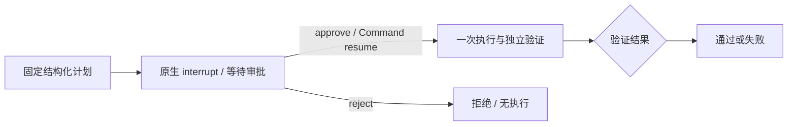

# 人工审批与持久化恢复

## 做了什么

显式提交 `workflow=langgraph-approval-v1` 后，系统生成固定计划，将计划和 LangGraph 原生检查点写入任务目录，进入 `awaiting_approval`。此时没有修复、测试或模型调用，Worker 已退出并释放并发名额。待审批任务仍计入容量上限，避免无限累积。

用户读取计划后提交 approve/reject。批准通过 `Command(resume=...)` 恢复同一个 thread_id 的审批节点，再执行一次既有修复和独立验证；拒绝进入终态 rejected，不执行修复。重复相同决定返回原任务，反向决定返回 409。默认执行及 `langgraph-v1` 继续兼容，不自动开启审批。



计划仍由代码生成，不能宣称 LLM 动态规划。审批针对整个任务计划，尚未逐条拦截工具调用，也没有审查后修改计划的接口。

## 持久化边界

- `tasks.sqlite3`：服务生命周期、幂等键、不可变审批决定和事件。
- 每任务 `checkpoints.sqlite3`：官方 SqliteSaver 保存计划、interrupt、决定和节点输出；不是靠 JSON 快照伪装恢复。
- `workflow.json`：可下载的诊断快照、计划和阶段事件，不作为恢复的唯一依据。
- `execution-started`：执行节点开始前独占创建的标记，保守阻止再次进入有副作用节点。

服务正常退出或强制退出后，已经进入 awaiting_approval 的任务保持待审批，不自动取消或执行。决定写入 SQLite 后、Worker 启动前发生崩溃，queued 恢复后读取原决定继续；每次新 Worker 都重新进行 PID 持久化与启动握手。

运行中崩溃沿用既有规则：清理身份匹配的孤儿进程树，标记 interrupted，不自动重放。即使原生检查点可重试失败节点，本适配器也不允许重放已开始的修复；需要另建任务。这是避免重复执行的保守策略，不是任意副作用的 exactly-once 保证，也不是执行中断点续修。执行标记写入后、真正执行前崩溃也会阻止重试。

取消等待任务直接进入 cancelled；取消执行中任务终止 Worker 和后代。终态由 `/tasks/{id}` 决定，部分 workflow.json 可能仍显示 executing。模型地址、预算等运行配置变化后，不允许用旧计划继续；应提交新任务。

检查点只接受基本数据结构，使用 `JsonPlusSerializer(allowed_msgpack_modules=[])` 限制自定义类型反序列化。数据库是本地可信文件，不通过 artifact API 暴露；内部检查点可能记录执行异常，不能作为可公开的脱敏日志。服务仍为本地单 owner、单服务 SQLite，没有审批人身份、鉴权或分布式并发审批保障。

实现依据：[官方 interrupt/Command 文档](https://docs.langchain.com/oss/python/langgraph/interrupts)、[官方 SQLite Checkpoint 扩展](https://pypi.org/project/langgraph-checkpoint-sqlite/)。依赖 extra：LangGraph `>=1.2.14,<2`、SQLite 扩展 `>=3.1.1,<4`。

## 本机演示（D 盘）

本轮未向 C 盘 Conda 环境安装包；SQLite 扩展和新增依赖在 `.tmp/workflow-deps`。当前 corecoder 环境终端先设置以下变量，再启动一个独立端口；现有 8001 服务未重启：

```powershell
$env:PYTHONPATH = 'D:\project_other\CoreCoder;D:\project_other\CoreCoder\.tmp\workflow-deps'
$env:PYTHONDONTWRITEBYTECODE = '1'
$env:TEMP = 'D:\project_other\CoreCoder\.tmp\python-temp'
$env:TMP = $env:TEMP
python -B -m uvicorn service.app:create_app --factory --host 127.0.0.1 --port 8003
```

该依赖目录属于本机临时安装，不提交 Git；干净部署安装 `.[service,workflow]` 到 D 盘 Python 环境或使用 Docker 镜像。Docker 实际数据目录已修复为 `D:\Users\admin\AppData\Local\Docker\wsl\DockerDesktopWSL`，镜像和卷在 D 盘；Docker 自身的小配置和日志仍可能由 Desktop 写入系统用户目录。

另一个终端：

```powershell
$body = '{"task_id":"timeout-units","mode":"scripted","workflow":"langgraph-approval-v1"}'
$headers = @{ 'Idempotency-Key' = 'approval-demo-001' }
$task = Invoke-RestMethod http://127.0.0.1:8003/tasks -Method Post -Headers $headers -ContentType application/json -Body $body
# 查询直到 state 为 awaiting_approval，然后阅读计划
Invoke-RestMethod "http://127.0.0.1:8003/tasks/$($task.id)"
Invoke-RestMethod "http://127.0.0.1:8003/tasks/$($task.id)/artifacts/workflow.json"
# 可先重启上述服务，确认仍为 awaiting_approval，再批准
Invoke-RestMethod "http://127.0.0.1:8003/tasks/$($task.id)/approval" -Method Post -ContentType application/json -Body '{"decision":"approve"}'
Invoke-RestMethod "http://127.0.0.1:8003/tasks/$($task.id)"
```

拒绝改为 `{"decision":"reject"}`；取消仍用 `POST /tasks/{id}/cancel`。审批接口成功返回 202，后台继续排队；非法决定 422，未知任务 404，非审批模式/非待审批任务/相反决定 409，缺少检查点依赖 503。等待期间 SSE 保持连接，终态结束流。

## 验收

测试全部为离线 scripted/unchanged 和真实进程故障注入，无新增真实模型调用或效果提升结论。独立验证通过才能 succeeded，批准本身不代表修复成功。

```powershell
python -B -m pytest tests/test_workflow_approval.py tests/test_approval_http_acceptance.py -q -p no:cacheprovider --basetemp=.tmp/approval-check
python -B -m deploy.approval_acceptance
python -B -m pytest tests -q -p no:cacheprovider --basetemp=.tmp/full-check
python -B -m deploy.acceptance
```

真实 HTTP 验收使用私有端口、独立数据目录，检查待审批强制重启、恢复批准、重复决定、拒绝/取消无执行、已批准执行崩溃、孤儿清理和不重放。容器验收包含相同 Linux 回归及生产服务待审批重启/批准/拒绝检查。

Windows 全量 **864 passed、2 skipped（156.62 秒）**；新增审批与真实 HTTP 回归 **12 项通过**，其中 HTTP 故障验收 **18 项检查全部通过**。两个跳过项来自既有平台条件。Ruff、pip check 和 Git diff 空白检查通过。HTTP 记录在 `.tmp/approval-full-tests/test_real_http_approval_restar0/acceptance.json`，所有自建服务和跟踪的 Worker 已退出。

最终镜像补验 **71 passed、无跳过（77.10 秒）**，**22 项容器端到端检查全部通过**；最终镜像已确认包含显式关闭检查点连接的修正。记录 `.tmp/approval-container-final-v1/acceptance.json`。验收容器和网络已清理，任务卷 `corecoder-acceptance-b0edd4db58_task-data` 保留。

可提交的精简证据：[workflow-approval-acceptance-v1.json](workflow-approval-acceptance-v1.json)，包含 Windows/HTTP/Linux 结果、依赖、镜像 ID、清理和存储路径。首轮记录 `.tmp/approval-container-acceptance-v1/acceptance.json` 留作历史，其 validation 镜像早于连接关闭修正，以最终记录为准。

## 简历可用表述

使用 LangGraph interrupt/Command 与 SQLite 原生检查点实现人工审批和跨进程恢复；通过持久化审批决定、幂等请求、独占执行标记和进程树清理防止重复执行，通过真实 HTTP 强制退出及 Linux 容器回归验证。适用范围为本地单服务，不宣称执行中任意节点续跑或生产级多用户审批。
